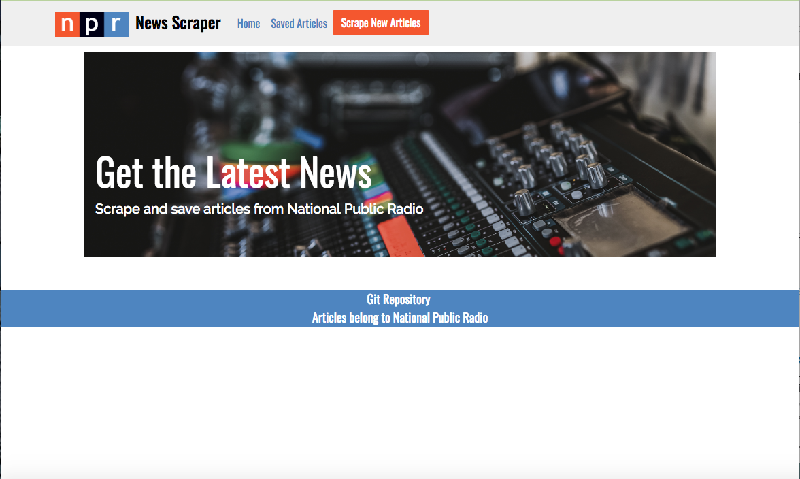
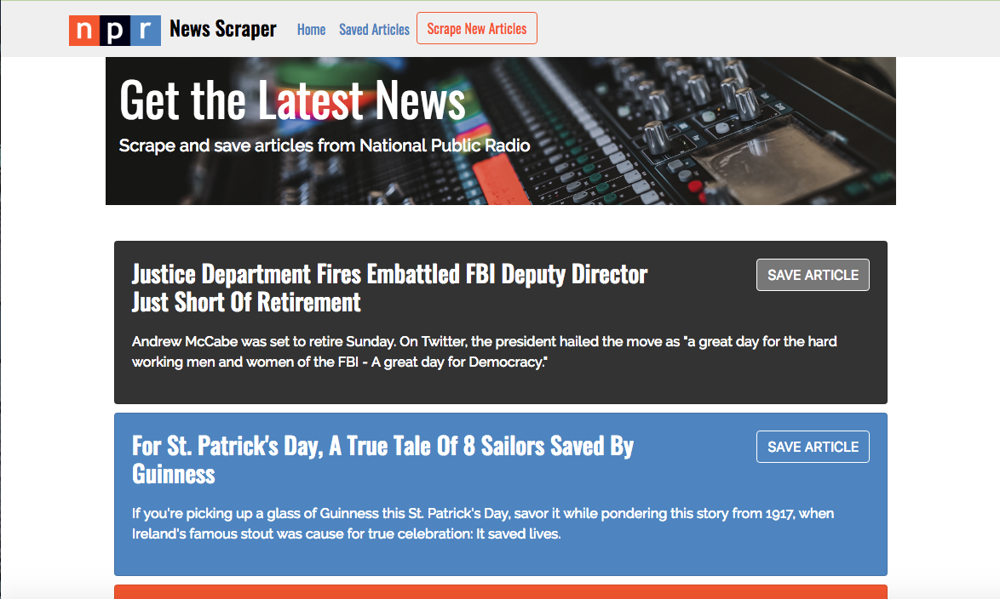
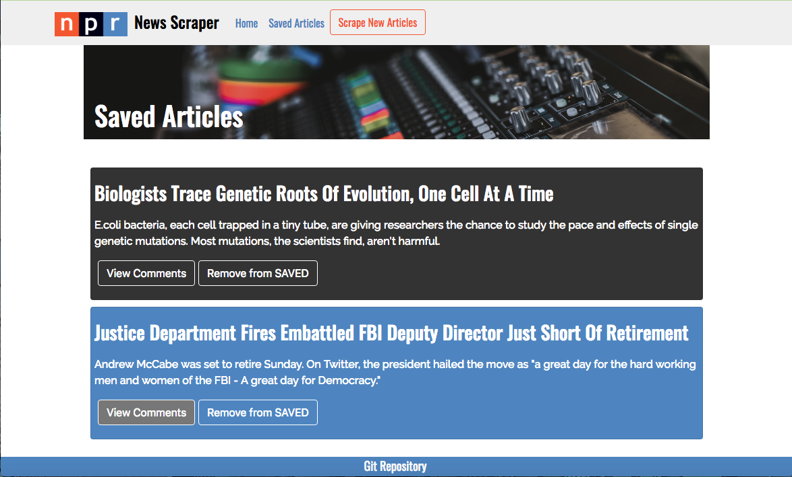
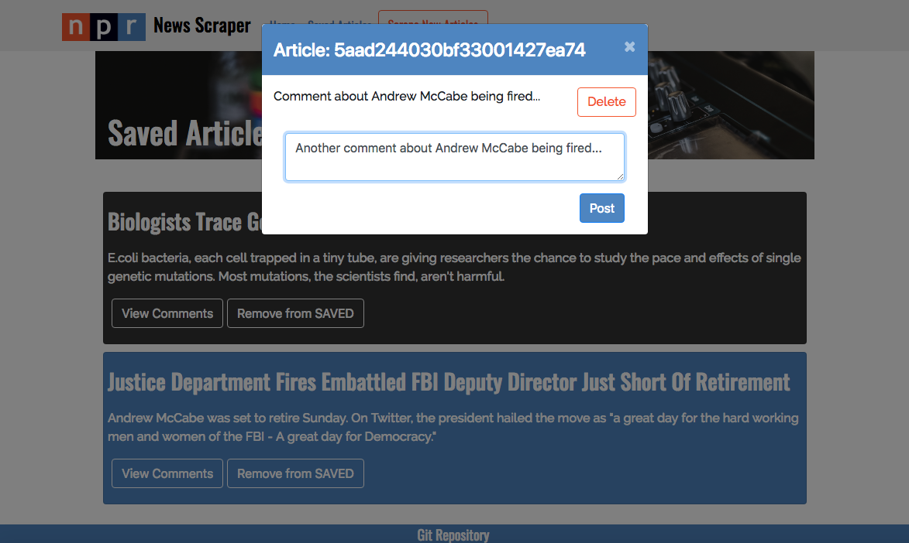

# NPR News Scraper

## Mongo Scraper Homework

This assignment was completed for Rutgers Coding Bootcamp. 
The assignment required us to create an app that lets users view and leave comments on the latest news scraped from an existing news site.

## Getting Started
  * https://boiling-wave-77710.herokuapp.com/
 

### Buying an Item

 * Home Page
 ---
  
  

 * Click the "Scrape New Articles" button to see the latest articles from NPR
 * Each result has a button for the user to save the article. The article will appear on the "Saved Articles" page and be input into the Mongo database
---
  
  

 * On the "Saved Articles" page, the user can see all saved articles, remove the article, and leave a comment 
---

 * The user can leave a comment on the article and it will be displayed with previous comments. Comments will be attached to the article within the database 
 * A comment can be deleted and it will be also removed from the Mongo database
---
  
  
## Programs Used
- express https://www.npmjs.com/package/express
- express-handlebars https://www.npmjs.com/package/express-handlebars
- mongoose https://www.npmjs.com/package/mongoose
- body-parser https://www.npmjs.com/package/body-parser
- cheerio https://www.npmjs.com/package/cheerio
- request https://www.npmjs.com/package/request

## Built With
- Sublime Text - Text Editor
- Node
- Mongoose/MongoDB

## Authors
- Sarika Matthew

## Instructors
- John Dougherty
- Tom Keel - TA
- Evan Arbeitman - TA
